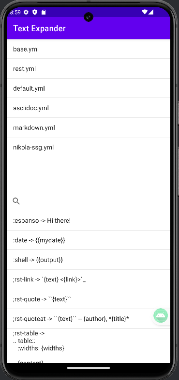
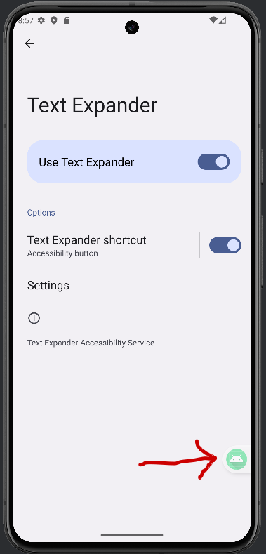

# Text Expander App - `espanso` app companion (not official)

Text Expander is an Android application that allows users to expand text shortcuts into longer predefined phrases. It uses an Accessibility Service to monitor text input and replace triggers with corresponding values in any application.
The app allows you to select a folder in your Documents folder, and load all the yaml files in the match folder insider the selected folder.

You can use it in 2 ways:

1. in the app, you can list, search and copy to clipboard all your triggers and replacements inside all your yaml files. 
2. you can activate the accessibility service and use text expansion in all the apps on your phone (as far as I have checked). You can also activate the Text Expander shortcut to get a small button to activate and deactivate the text expansion on typing feature.





# Why?

I am now using Linux and Windows at work, and just got an Android Phone and I thought it would be cool to get access to my `espanso` triggers on it. It works just with simple replacements, but I think it is enough for now.  

# Disclaimer

This is my very first Android App. I made heavy use fo ChatGpt 4. 4o, Perplexity, Google and Coffee ☕.
I expect there to be errors and you are welcome to create an Issue and fix it 😁

## Features

- **Parse YAML Files:** Reads `.yml` files from the `Documents/espanso/match` directory to load text expansion triggers and values.
- **List Files and Triggers:** Displays the list of YAML files and their triggers and values.
- **Search Functionality:** Provides a search bar to filter triggers and values.
- **Clipboard Copy:** Copies the value of a trigger to the clipboard when a trigger-value pair is clicked.
- **Text Expansion:** Expands text shortcuts into longer predefined phrases in any app using an Accessibility Service.

## Setup and Usage

### Prerequisites

- Android Studio installed on your computer.
- A device or emulator running Android 13 or higher.

### Installation

1. Clone the repository:
   ```shell
   git clone https://github.com/dacog/textexpander_android.git
   ```
2. Open the project in Android Studio.
3. Build and run the project on your device or emulator.

### Configuration

1. Place your YAML files in the `Documents/espanso/match` directory on your device. The YAML files should contain triggers and replacement values in the following format:

   ```yaml
   matches:
     - trigger: ":example"
       replace: "This is an example replacement text."
   ```
   
You can use an app such as [FolderSync](https://foldersync.io/) to sync your `espanso` folder with the phone from Dropbox, Google Drive, OneDrive or WebDav (NextCloud).

You may also use git or just copy the `espanso` folder you have in your computer to your Documents folder on your phone.

2. Open the Text Expander app and select the `Documents/espanso/match` directory. The app will parse the YAML files and display the triggers and values.

### Enabling the Accessibility Service

1. Go to `Settings` -> `Accessibility`.
2. Find and select `Text Expander Accessibility Service`.
3. Enable the service.

**You can check the code, but the app just uses the accessibility service to expand your triggers. Nothing more, nothing less.** 


### Using the App

- **Search Triggers:** Use the search bar to filter triggers and values.
- **Copy to Clipboard:** Tap on a trigger-value pair to copy the value to the clipboard.
- **Text Expansion:** Type a trigger in any app and see it expand to the predefined value.

## Code Structure

- `MainActivity.kt`: Handles the UI, file selection, parsing YAML files, and displaying the list of triggers and values.
- `TextExpanderService.kt`: Monitors text input and performs text expansion using the triggers loaded from YAML files.
- `CustomTriggerAdapter.kt`: A custom adapter for the `ListView` to implement fuzzy search functionality.

## Dependencies

- [SnakeYAML](https://bitbucket.org/asomov/snakeyaml): A YAML parser for Java.
- AndroidX Libraries: Core, AppCompat, Material, Activity KTX, and DocumentFile.

## Contributing

Contributions are welcome! Please open an issue or submit a pull request for any improvements or bug fixes. 

As I wrote in the Disclaimer above, I expect there to be errors and you are welcome to create an Issue and fix any error you may find 😁


## License

This project is licensed under the GPL v3 License - see the [LICENSE](LICENSE) file for details.

## Acknowledgements

- This project uses the [SnakeYAML](https://bitbucket.org/snakeyaml/snakeyaml/) library for parsing YAML files.
- [Espanso](https://github.com/espanso/espanso) from [Federico Terzi](https://federicoterzi.com/). This is why I though of making the app. 

## Contact

You can ifnd me in [LinkedIn](https://www.linkedin.com/in/diegocarrasco/), in [GitHub](https://github.com/dacog/) and on [my page](https://diegocarrasco.com/)